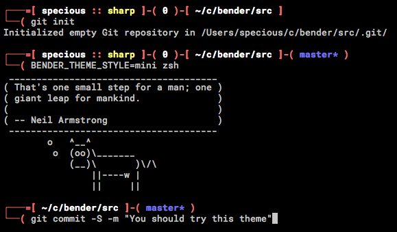

# bender (zsh theme)

Fancy two-line [oh-my-zsh](https://github.com/robbyrussell/oh-my-zsh) prompt with [git](https://git-scm.com/) integration.



## Install

### Manual install

- Put [bender.zsh-theme](https://raw.githubusercontent.com/specious/bender/master/bender.zsh-theme) in `~/.oh-my-zsh/custom/themes/`
- Set `ZSH_THEME="bender"` in your `~/.zshrc`
- Reload zsh configuration by running: `source ~/.zshrc`

### Use a zsh plugin manager

You can use a zsh plugin manager such as [antigen](https://github.com/zsh-users/antigen), [zgen](https://github.com/tarjoilija/zgen) or [zplug](https://github.com/zplug/zplug).

## Configuration

You can enable a minimal version of the prompt by setting in your `~/.zshrc`:

```
BENDER_THEME_STYLE=mini
```

## What about bash?

Bash version is [here](https://gist.github.com/specious/8244801).

## Want to help?

Contributions are welcome. Please check the [issues](https://github.com/specious/bender/issues) and feel free to point out how it could be better or open a pull request.

## License

MIT